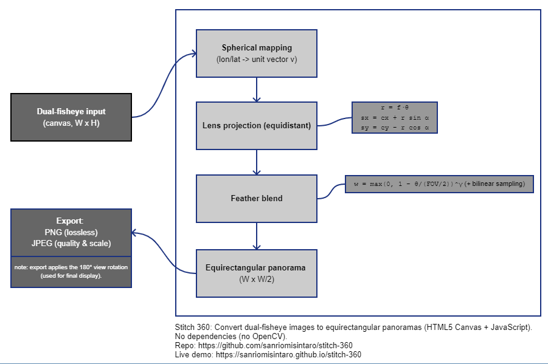
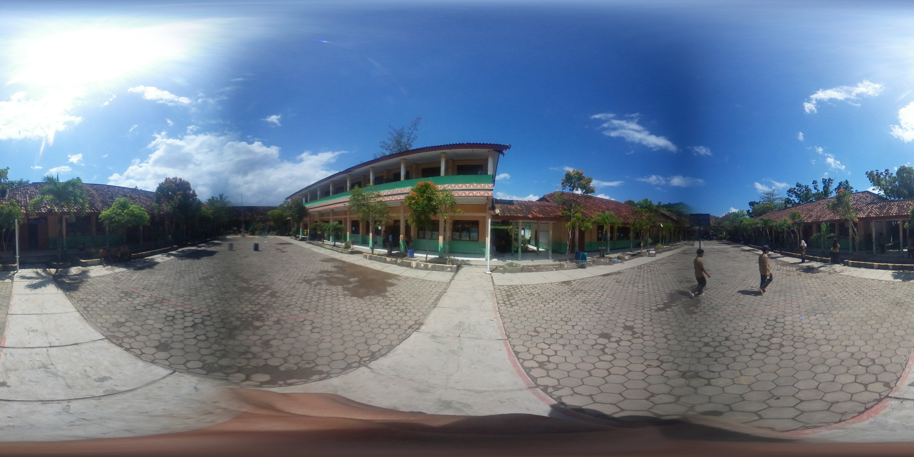
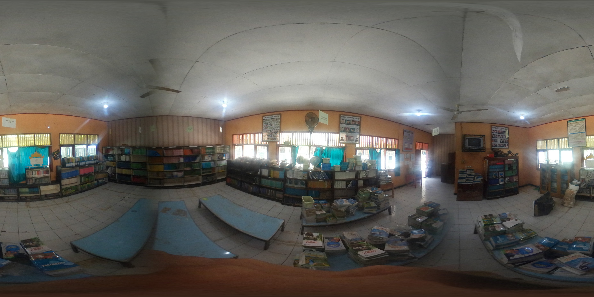
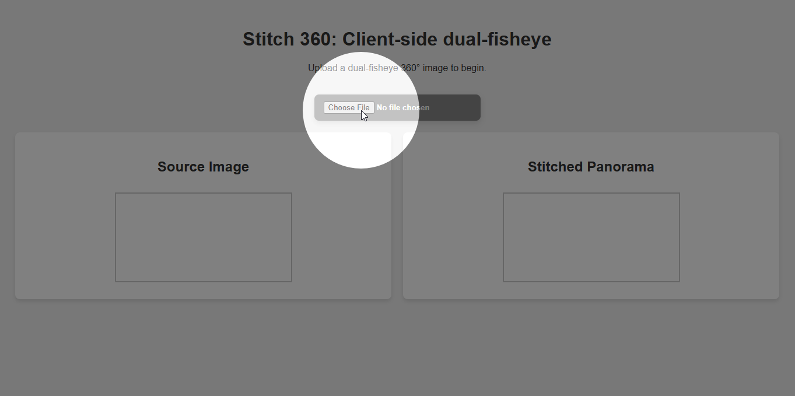
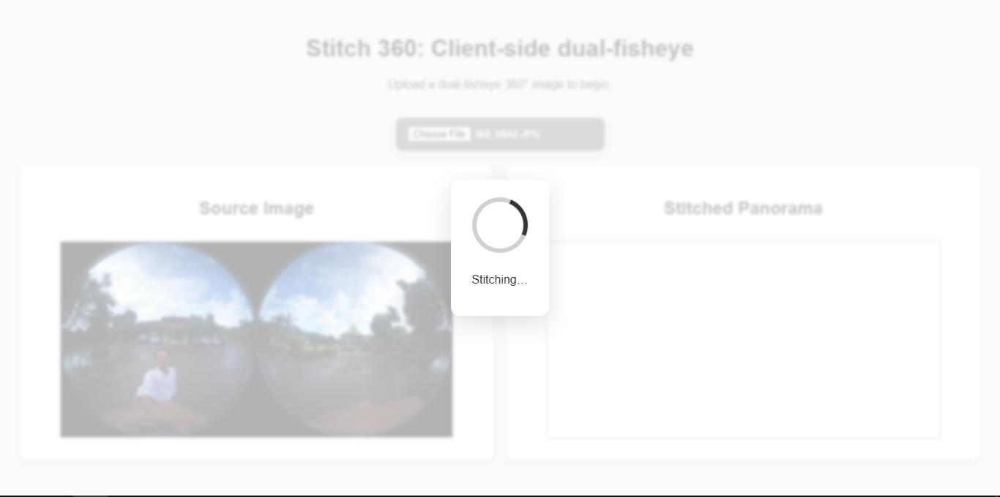
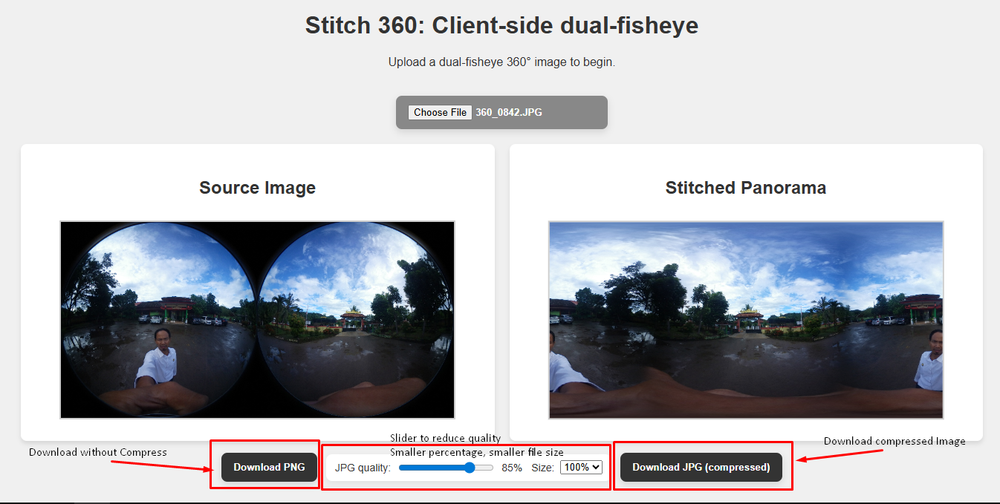

# Stitch 360

> Convert dual-fisheye images to equirectangular panoramas — in your browser (HTML5 Canvas, vanilla JS). No installs, no uploads.

[**Live demo**](https://sanriomisintaro.github.io/stitch-360/)  
Repository: https://github.com/sanriomisintaro/stitch-360

---

## Quick look

### Example 1
**Input (dual-fisheye)**  

**Output (equirectangular)**  

### Example 2
**Input (dual-fisheye)**  

**Output (equirectangular)**  

---

## Features

- **Pure client-side** (vanilla JavaScript + HTML5 Canvas). Works offline.
- **Fisheye -> equirectangular** using the equidistant model (`r = f * θ`) with feather-blended overlap.
- **Export**:  
  - **PNG** (lossless)  
  - **JPG (compressed)** with **quality slider** and **size** (100% / 75% / 50%)
- **Responsive UI**: progress overlay during stitching.
- **No dependencies** (no OpenCV, no frameworks).

---

## Try it

1) Open the live demo: https://sanriomisintaro.github.io/stitch-360/  
2) Load a dual-fisheye image.  
3) Wait for stitching, then **Download PNG** or **Download JPG (compressed)**.

**Tutorial screenshots**

Step 1 – Open file  

Step 2 – Wait for stitching to finish  

Step 3 – Set options and download results  

---

## How it works (very short)

1) lon/lat -> unit vector **v**  
2) Project to each fisheye (equidistant): `r = f * θ`, `sx = cx + r sin α`, `sy = cy − r cos α`  
3) **Feather blend** in overlap: `w = max(0, 1 − θ/(FOV/2))^γ` (bilinear sampling)  
4) Write to **equirectangular panorama** (W × W/2)

See the paper for details.

---

## Calibration knobs

Tune these in `stitcher.js`:

- `fovDeg` (try 198–205 for wider overlap)  
- `radiusScale` (lens circle crop)  
- `centers.left/right` (normalized `[x/W, y/H]`)  
- `rollDeg` and `yawBiasDeg` (per-lens alignment)  
- `blend.gamma` (softer/harder seam)

---

## Export & compression

- **PNG** = lossless.  
- **JPG** = choose **Quality** (0.50–0.95) and **Size** (100/75/50%).  
- Export uses an offscreen canvas and applies the **same 180° view rotation** as the on-screen canvas, so the file matches what you see.

---

## Privacy

All processing happens **in your browser**. Images are **not uploaded**.

---

## Minimal tests

Open `docs/tests/test.html` in a browser.  
It checks a few pure math invariants (feather weight, equidistant relation, `H = W/2`).  

---

## Cite

If this tool helps your work, please cite:

- **Paper**: see `paper/paper.md` (JOSS submission).  
- **Software**: `CITATION.cff` is included.

Example (Live Demo):
Sanriomi Sintaro. Stitch 360: Convert dual-fisheye images to equirectangular panoramas.
https://sanriomisintaro.github.io/stitch-360

---

## Acknowledgements

Inspired in part by community web tools for Gear 360 content (e.g., NadirPatch Gear 360 Stitching).  
Built with **vanilla JavaScript** and HTML5 Canvas.

---

## License

MIT (see `LICENSE`).
