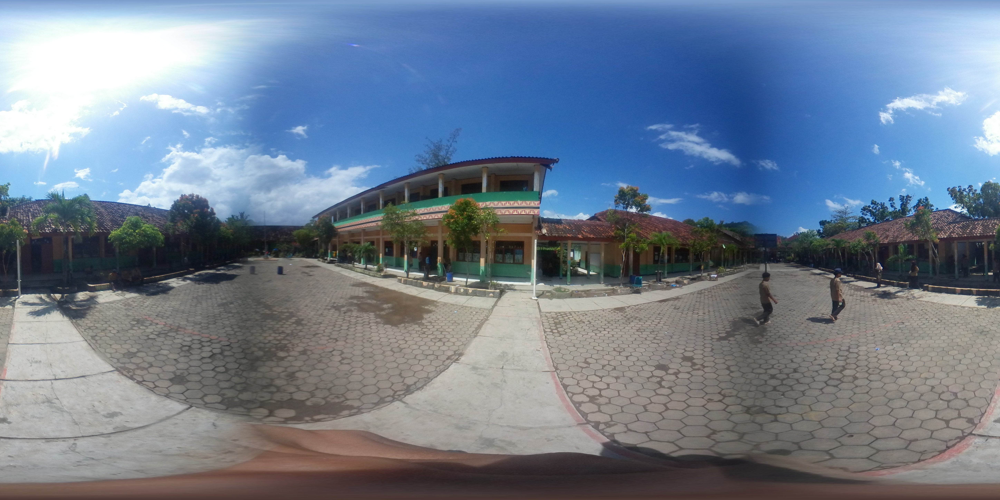

# Summary

**Stitch 360** is a lightweight, open-source tool for converting **dual-fisheye 360° images** into standard **equirectangular panoramas** entirely in the web browser. The pipeline implements an equidistant fisheye model ($r = f\,\theta$) for each lens and maps spherical directions to the two input hemispheres, then **feather-blends** overlap regions to reduce seam artifacts. Because it runs client-side with HTML5 Canvas and JavaScript, Stitch 360 requires **no installation**, never uploads images to a server, and works offline—useful for teaching, field work, and reproducible demos. *Stitch 360 has no external dependencies (no OpenCV); it is implemented in vanilla JavaScript and HTML5 Canvas.*

Repository: <https://github.com/sanriomisintaro/stitch-360>  
Live demo (GitHub Pages): <https://sanriomisintaro.github.io/stitch-360/>  
Project tagline: *Convert dual-fisheye images to equirectangular panoramas.*

# Statement of need

Researchers, educators, and practitioners frequently need to **stitch dual-fisheye frames** (e.g., consumer 360 cameras, lab rigs) without setting up native toolchains or sending data to the cloud. Mature desktop stitchers (e.g., OpenCV’s Stitcher, Hugin, PTGui) are powerful, but they require native environments, packaging, or licenses [@opencv-stitching; @opencv-stitcher-tutorial; @hugin; @ptgui]. There are also **web-based tools** that perform server-side conversions—notably the *Gear 360 Stitching* page by NadirPatch—where users upload raw dual-fisheye images and receive stitched panoramas [@nadirpatch-gear360]. Stitch 360 targets **rapid, transparent preprocessing in the browser** with:

- a **clear geometric model** (equidistant fisheye -> equirectangular) [@plaut-fisheye; @pano-fisheye; @panotools-equirect; @wiki-equirect],
- **interactive feedback** (progress overlay, responsive rendering), and
- **deterministic, parameterized seams** (per-lens centers, FOV, roll/yaw, blend gamma).

This combination makes it practical for **teaching projection geometry**, lightweight field data processing, and methods sections where readers can replicate the exact mapping with a single HTML page.

# State of the field

OpenCV exposes a high-level `cv::Stitcher` pipeline covering feature detection, pairwise alignment, warping, exposure compensation, and blending [@opencv-stitching; @opencv-stitcher-class; @opencv-stitcher-tutorial]. Hugin and PTGui provide richly configurable native workflows [@hugin; @ptgui]. In contrast, Stitch 360 focuses on the specific **dual-fisheye -> equirectangular** case in a **zero-install browser** environment, with explicit control of projection parameters and a simple feather blend. We do **not** depend on those packages; they are cited as related work and potential baselines for comparison.

# Methods

Let $(\lambda, \varphi)$ denote longitude/latitude (yaw/pitch) on the unit sphere. The equirectangular output of width $W$ and height $H = \tfrac{W}{2}$ uses the standard mapping  
\[
x = W \cdot \frac{\lambda + \pi}{2\pi}, \quad
y = H \cdot \frac{\varphi + \frac{\pi}{2}}{\pi}
\]
[@wiki-equirect; @panotools-equirect].

Each panorama pixel corresponds to a unit direction $\mathbf{v} \in \mathbb{R}^3$. For each lens (left/right) we compute the angle $\theta$ between $\mathbf{v}$ and the lens optical axis. Under the **equidistant fisheye** model, the image-plane radius is $r = f\,\theta$ with $f = \tfrac{R}{\text{FOV}/2}$, where $R$ is the calibrated lens-circle radius. With per-lens **roll** and optional **yaw bias**, we obtain azimuth $\alpha$ around the axis and sample source coordinates
\[
s_x = c_x + r\sin\alpha, \qquad
s_y = c_y - r\cos\alpha,
\]
bounded by a calibrated circle. Overlaps are blended with a smooth feather weight
\[
w = \max\!\left(0,\, 1 - \frac{\theta}{\mathrm{FOV}/2}\right)^{\gamma},
\]
and colors are bilinearly interpolated before normalized averaging. The repository documents defaults (centers, FOV, $\gamma$) and calibration tips.

For clarity, the per-pixel pipeline can be summarized as:

1. $(p_x, p_y)$ -> $(\lambda, \varphi)$ -> unit vector $\mathbf{v}$.  
2. For each lens, compute $\theta$; skip if $\theta > \text{FOV}/2$.  
3. Equidistant projection: $r = f\,\theta$; azimuth $\alpha$ -> source $(s_x, s_y)$.  
4. Bilinear sample and feather blend contributions from both lenses.

# Implementation

Stitch 360 is a single-page web app (HTML/CSS/JavaScript). It reads a dual-fisheye image into a canvas, performs per-pixel mapping and blending into an equirectangular canvas, and exposes **PNG/JPEG export** (with quality and downscale options). Long loops **yield** via `requestAnimationFrame` to keep the UI responsive during stitching. **Dependencies:** none (no OpenCV or native libraries). A minimal UI adds (i) a progress overlay, (ii) save as PNG (lossless), and (iii) **save as JPEG (compressed) with a quality slider and optional downscale (100/75/50%)** implemented via an offscreen canvas (JPEG uses an opaque white background to avoid alpha artifacts).

{ width=70% }

# Quality control and performance

The repository includes or plans to include:
- **Unit tests** for projection math and feather weights (e.g., $r = f\,\theta$ limits, center/roll handling).
- **Scripted examples** with known inputs (synthetic equirectangular -> dual-fisheye -> back to equirectangular).
- **Benchmark notes** for common resolutions (e.g., 5760×2880, 7776×3888) on a mid-range laptop and a mobile browser, aligning with best practices in stitching literature [@szeliski-tutorial].

# Example

**Input (dual-fisheye)**  
{ width=70% }

**Output (equirectangular panorama)**  
{ width=70% }

# Acknowledgements

I thank the open-source imaging community for discussions and tools that informed this work. Inspiration for this project came in part from community web tools for Gear 360 content (e.g., the NadirPatch Gear 360 Stitching page) [@nadirpatch-gear360].

# References
